<h1 align="center">VibeIDE</h1>

<p align="center">
  <strong>A VS Code-style IDE for Android, with a real Linux sandbox on the device<br>and an AI agent whose edits you review before they land.</strong>
</p>

<p align="center">
  
  
  
  
</p>

<p align="center">
  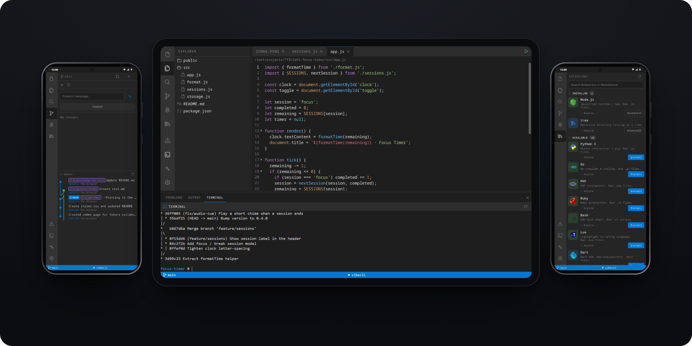
</p>

---

## What is VibeIDE?

VibeIDE puts a real development environment on an Android phone. It extracts a small **Alpine Linux** userland and boots it with **proot**, so no root is needed. Your projects, `git`, and any tools you install live inside that sandbox.

The app is laid out like desktop VS Code: an activity bar, file explorer, tabbed editor, terminal, source control and a command palette. It's built for touch, and it opens a side-by-side layout on tablets and in landscape.

It's for developers who want to make real changes to real repos away from a laptop. Clone a repository, fix something by hand or ask the AI agent, review the diff, commit, and open the pull request, all on the device.

## Why?

Coding on a phone usually means one of two compromises:
- an editor with no toolchain behind it, or
- a thin client for a machine somewhere else.

VibeIDE takes the other route: it runs the Linux environment locally and builds a proper IDE on top of it. When there's something the UI doesn't cover, the terminal is a real shell.

---

## Features

### AI agent with review before apply

Bring your own **Claude**, **OpenAI** or **Gemini** key. With **Agent** mode on, the assistant sees your project's file list and proposes whole-file changes. Nothing is written until you **approve**. You can approve or reject everything at once or file by file, view the diff for each file, and **undo** afterwards. A daily token budget keeps usage predictable.

<p align="center">
  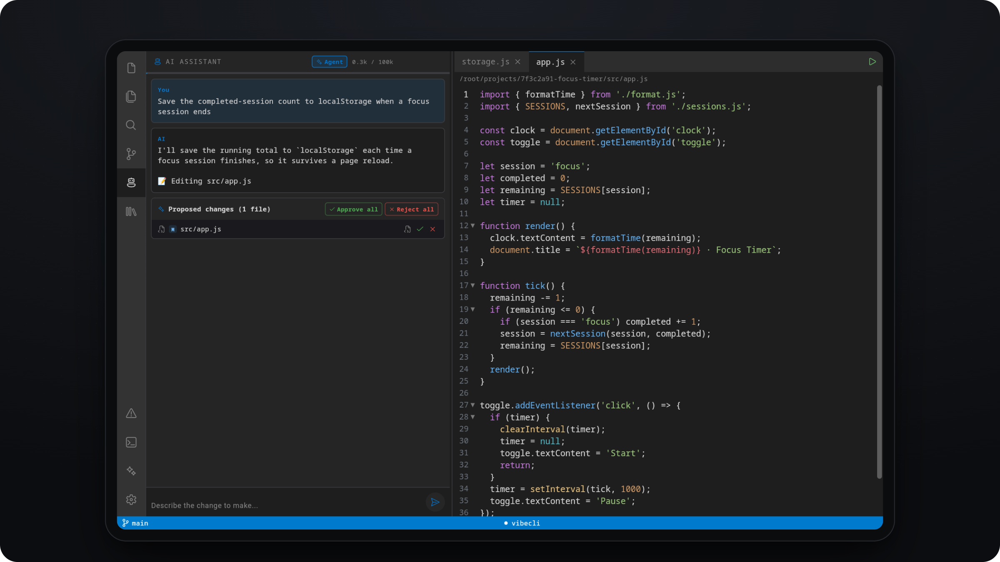
</p>

### Git and pull requests on the device

- **Source control:** stage and commit, pull, fetch, merge, and a commit graph with branch labels.
- **AI commit messages:** one tap writes a conventional commit message from your changes (`git diff HEAD`).
- **Merge conflicts:** resolve them in the editor with Accept Current / Incoming / Both.
- **Pull requests:** compare branches (commits, files, unified or split diff), let AI draft the title and description, and create the PR. You can also browse open PRs, check CI status, and merge, squash or rebase.

<p align="center">
  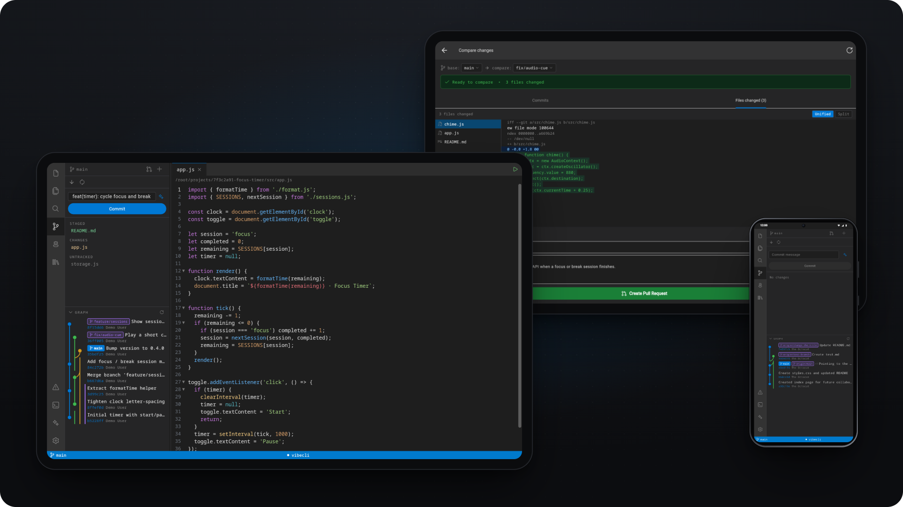
</p>

### A real Linux sandbox

- **What's inside:** an Alpine 3.21 rootfs (about 3.8 MB compressed) ships in the APK and is extracted on first launch.
- **How the UI reaches it:** a small Go daemon, **vibecli**, runs inside the sandbox and serves files, shell, PTY and git to the UI over `127.0.0.1:7700`.
- **Terminal:** xterm.js connected to a real PTY, opened in your project directory.

### Tools installed on demand

The **Extensions** panel is a curated catalog of 32 developer tools. They install globally into the sandbox with `apk`, `npm` or `pip`:
- **Runtimes:** Node.js, Python, Go, PHP, Ruby, Bash, Lua.
- **Languages:** Dart, Flutter, Rust, Java, Kotlin, C/C++, Perl.
- **Formatters & linters:** Prettier, ESLint, TypeScript, Black, Ruff, Flake8, ShellCheck.
- **Utilities:** everyday command-line tools such as ripgrep, jq and Vim.

Installed tools light up **Run File**, **Format Document** (with format-on-save) and **Lint → Problems** in the editor.

<p align="center">
  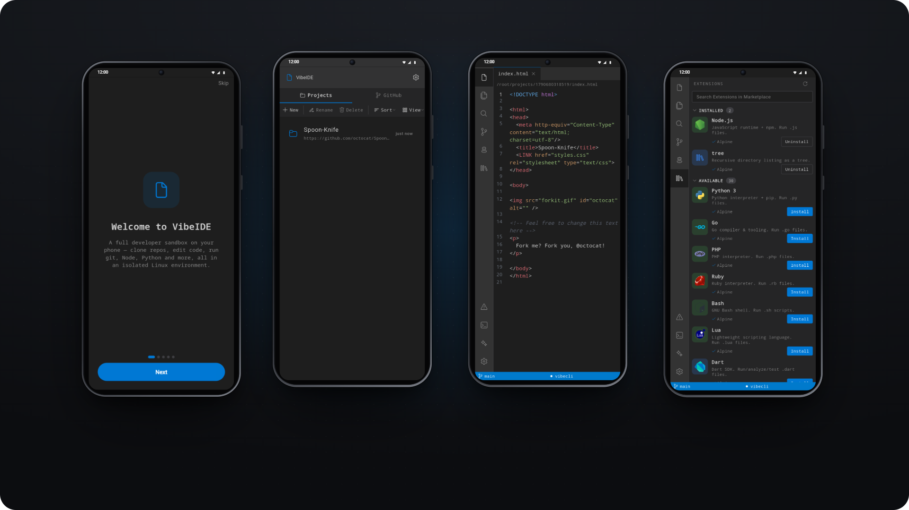
</p>

### Also included

- **GitHub sign-in** via Device Flow. Browse your repos and your orgs' repos, or clone any URL.
- **Workspace search** with case-sensitive and regex modes.
- **Command palette** (`Ctrl+Shift+P`).
- **Live Server** preview of static sites on port 5500.
- **Adaptive layout:** one panel at a time on phones; a resizable side panel next to the editor at 720 dp and wider.

---

## How it works

<p align="center">
  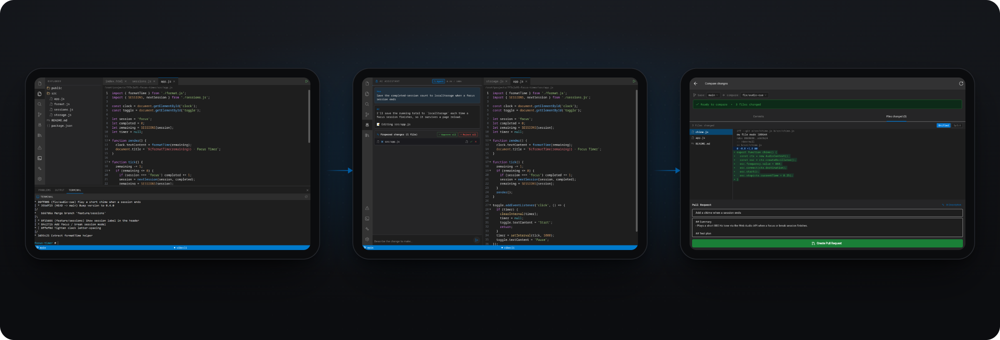
</p>

1. **Clone.** Sign in with GitHub, pick a repo (or paste a URL), and VibeIDE clones it into the sandbox.
2. **Edit.** Work in the editor and terminal, or turn on **Agent** mode, describe the change, and review what it proposes.
3. **Ship.** Commit from Source Control, compare your branch, and open a pull request with an AI-drafted description.

---

## Product showcase

<table>
  <tr>
    <td width="50%">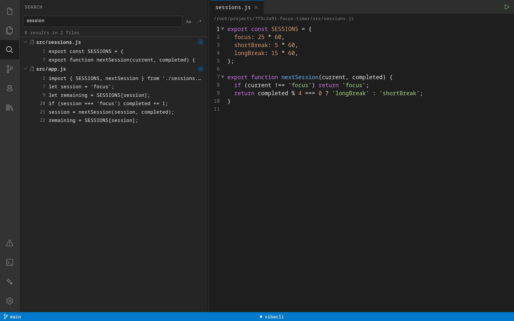</td>
    <td width="50%">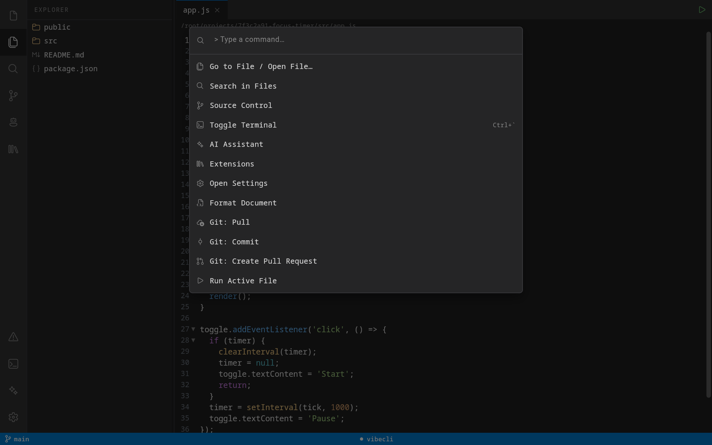</td>
  </tr>
  <tr>
    <td align="center"><sub>Workspace search</sub></td>
    <td align="center"><sub>Command palette</sub></td>
  </tr>
</table>

<table>
  <tr>
    <td width="25%">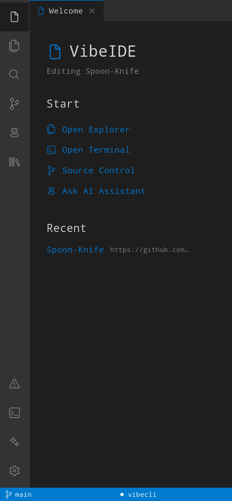</td>
    <td width="25%">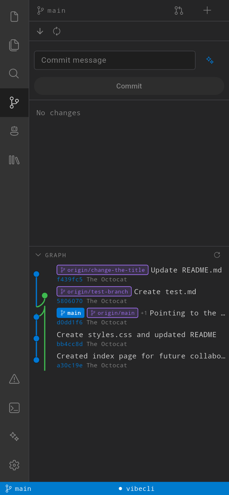</td>
    <td width="25%">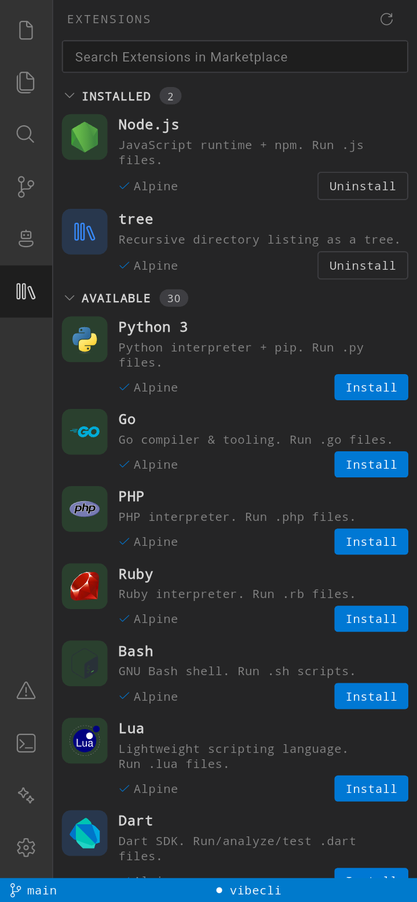</td>
    <td width="25%">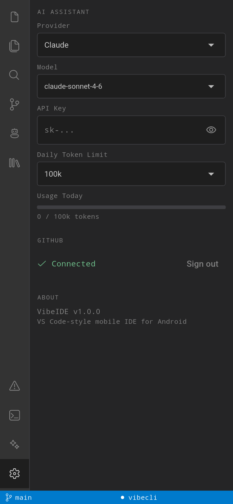</td>
  </tr>
  <tr>
    <td align="center"><sub>Welcome</sub></td>
    <td align="center"><sub>Source Control</sub></td>
    <td align="center"><sub>Extensions</sub></td>
    <td align="center"><sub>Settings</sub></td>
  </tr>
</table>

<sub>Phone screenshots are from a Galaxy A12s running the app. Wide screenshots show the tablet layout at 1280×800 dp, rendered from the app's own widgets against a real `vibecli`. The AI output in them is a scripted stand-in. Details are in <a href="docs/README_PRODUCT_ANALYSIS.md#how-screenshots-were-captured">how screenshots were captured</a>.</sub>

---

## Architecture

```text
┌───────────────────────────────────────────────────────────────┐
│ Flutter UI (Riverpod)                                         │
│ editor · explorer · terminal · SCM · PRs · AI · extensions    │
└──────────────┬───────────────────────────────┬────────────────┘
               │ MethodChannel                 │ HTTP · SSE · WebSocket
               │ com.vibeide/proot             │ 127.0.0.1:7700
┌──────────────▼──────────────┐                │
│ Kotlin ProotPlugin          │                │
│ extract rootfs · start/stop │                │
└──────────────┬──────────────┘                │
               │ proot (no root)               │
┌──────────────▼───────────────────────────────▼────────────────┐
│ Alpine Linux 3.21 sandbox                                     │
│   vibecli (Go)  /fs/*  /shell/exec  /shell/pty  /git/*        │
│   git · apk · node · python · …    /root/projects/<id>/       │
└───────────────────────────────────────────────────────────────┘
        The app itself calls: GitHub API · Anthropic / OpenAI / Gemini
```

| vibecli endpoint | Purpose |
|---|---|
| `GET /health` | Readiness check |
| `GET /fs/tree` · `GET /fs/read` · `POST /fs/write` · `POST /fs/delete` | Files |
| `GET /fs/watch` | File-change events (SSE) |
| `POST /shell/exec` | Run a command, stream output (SSE) |
| `GET /shell/pty` | Interactive terminal (WebSocket) |
| `POST /git/clone` · `GET /git/status` · `GET /git/diff` · `GET /git/log` · `POST /git/commit` · `POST /git/push` · `POST /git/checkout` | Git |

## Tech stack

| Layer | Technology |
|---|---|
| App | Flutter, Dart 3.11, Riverpod |
| Editor | `re_editor`, `re_highlight` |
| Terminal & preview | xterm.js 5.3 in `flutter_inappwebview` |
| Networking | `dio` (vibecli), `http` (AI streaming, GitHub API) |
| Storage | `sqflite` (projects, token usage), `flutter_secure_storage` (GitHub token) |
| Android | Kotlin `ProotPlugin`, proot + talloc (`arm64-v8a`), Alpine Linux 3.21 rootfs |
| Daemon | Go 1.23: `net/http`, `creack/pty`, `fsnotify`, `gorilla/websocket` |
| Integrations | GitHub REST API + OAuth Device Flow; Anthropic, OpenAI and Gemini streaming APIs |

---

## Getting started

**You need:** the Flutter SDK (Dart ≥ 3.11), the Android SDK, and an **ARM64 Android device** with USB debugging on. The sandbox binaries are `arm64-v8a` only, so x86 emulators won't boot it.

```bash
git clone https://github.com/Harshul1484/vibeide.git
cd vibeide/vibeide
flutter pub get
flutter run            # with the device connected
```

On first launch, onboarding extracts the Linux sandbox (one time). After that, clone a repo from the **GitHub** tab or with **New** → *Clone Repository*.

### Configuration

There are no environment variables. Configuration is in two places:

| What | Where |
|---|---|
| AI provider, model, API key, daily token limit | In the app: **Settings → AI Assistant**. The API key is held in memory for the current session. |
| GitHub OAuth App client ID | `githubClientId` in [`vibeide/lib/features/auth/github_auth.dart`](vibeide/lib/features/auth/github_auth.dart). For your own build, create an OAuth App with **Device Flow** enabled and put its client ID here. No client secret is needed. |

---

## Project structure

```text
.
├── vibeide/                         Flutter app
│   ├── lib/
│   │   ├── app.dart, main.dart
│   │   ├── features/
│   │   │   ├── ai/                  chat, agent-mode edit protocol, review flow
│   │   │   ├── auth/                GitHub Device Flow + REST client
│   │   │   ├── editor/  explorer/  search/  command_palette/
│   │   │   ├── git/                 SCM panel, graph, diff, conflicts, PRs
│   │   │   ├── extensions/          dev-tool catalog + installer
│   │   │   ├── terminal/  preview/  problems/
│   │   │   ├── projects/  onboarding/  settings/
│   │   │   ├── sandbox/             proot channel + vibecli client
│   │   │   └── shell/               activity bar, layouts, status bar
│   │   └── shared/                  theme, codicons, db
│   ├── assets/terminal/index.html   xterm.js terminal page
│   └── android/app/src/main/
│       ├── kotlin/…/ProotPlugin.kt  sandbox launcher
│       ├── assets/alpine-rootfs.dat Alpine 3.21 rootfs
│       └── jniLibs/arm64-v8a/       proot, talloc, vibecli
├── vibecli/                         Go daemon (fs, shell, git, middleware)
└── docs/                            PRDs, design specs, screenshots
```

## Development

**App**

```bash
cd vibeide
flutter analyze
flutter test
```

**vibecli.** The app runs the binary bundled at `jniLibs/arm64-v8a/libvibecli.so`. After changing the daemon, rebuild it and copy it there:

```bash
cd vibecli
go test ./...
GOOS=linux GOARCH=arm64 CGO_ENABLED=0 go build -ldflags="-s -w" -o dist/vibecli-arm64 .
cp dist/vibecli-arm64 ../vibeide/android/app/src/main/jniLibs/arm64-v8a/libvibecli.so
```

The daemon's design is documented step by step in [`docs/PRD-001`](docs/PRD-001-vibecli-server-skeleton.md) through [`PRD-007`](docs/PRD-007-vibecli-build-script.md). The app design is in [`docs/superpowers/specs/`](docs/superpowers/specs/).

## Roadmap

- **Claude Code in the sandbox.** Run the real Claude Code CLI inside Alpine, with a native chat view and permission modes. The design is approved in [`2026-06-22-claude-code-integration-design.md`](docs/superpowers/specs/2026-06-22-claude-code-integration-design.md). Its first layer, the Alpine 3.21 base, is already shipped.

## Contributing

Issues and pull requests are welcome. For a change:

1. Branch from `main`.
2. Keep the Flutter feature code in its `lib/features/<area>/` folder.
3. Run `flutter analyze`, `flutter test` and `go test ./...`.
4. If you change `vibecli`, rebuild the ARM64 binary as described in [Development](#development).
