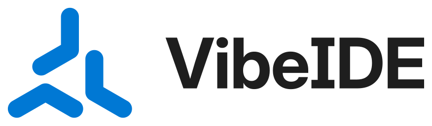

# VibeIDE — Logo Guidelines

  

## 1. The logo

**Idea.** The mark is three chevrons chasing each other around one centre: you, the AI and your code, moving as one. It's in the same family as today's minimal AI marks: friendly, rotational, and made of a single idea. It's drawn in the app's own accent blue.

**Construction.**
- Three identical chevrons at 120° rotational symmetry.
- Each chevron is two capsules of one width, meeting at a 120° angle.
- All ends are round.
- The files contain no strokes, text, effects or gradients. Every shape is a filled outline.

**Versions**

| | File | Use it for |
|---|---|---|
| Primary | [`logo/vibeide-horizontal.svg`](logo/vibeide-horizontal.svg) | Headers, READMEs, websites, anywhere with horizontal room |
| Primary, on dark | [`logo/vibeide-horizontal-on-dark.svg`](logo/vibeide-horizontal-on-dark.svg) | Same lockup with a white wordmark and the blue symbol, for dark backgrounds (e.g. GitHub dark mode) |
| Stacked | [`logo/vibeide-stacked.svg`](logo/vibeide-stacked.svg) | Square spaces, splash screens, stickers |
| Symbol | [`logo/vibeide-symbol.svg`](logo/vibeide-symbol.svg) | Avatars, app icon, when the name is already nearby |
| Symbol, small sizes | [`logo/vibeide-symbol-small.svg`](logo/vibeide-symbol-small.svg) | Anything drawn under 48 px (heavier arms keep the gaps open) |
| Wordmark | [`logo/vibeide-wordmark.svg`](logo/vibeide-wordmark.svg) | Text-only contexts |

Every version comes in **colour**, **`-black`** and **`-white`** (reversed). There are PNGs at 1200 px (lockups) and at 512/1024 px (symbol).

## 2. Clear space

Keep a clear zone around the logo equal to **one chevron thickness**: the width of one arm of the symbol. That is 28 units on the 256-unit symbol canvas, about ⅙ of the mark's height. The zone scales with the logo, so never use a fixed distance.

## 3. Minimum size

| Version | Screen | Print |
|---|---|---|
| Horizontal | 120 px wide | 30 mm wide |
| Stacked | 64 px wide | 16 mm wide |
| Symbol | 16 px (use the **small** file below 48 px) | 6 mm |

## 4. Colour

The palette is the app's own (`vibeide/lib/shared/theme.dart`).

| Name | HEX | RGB | CMYK (approx.) | Role |
|---|---|---|---|---|
| **VibeIDE Blue** | `#0078D4` | 0 120 212 | 100 43 0 17 | The symbol |
| **Editor Dark** | `#1E1E1E` | 30 30 30 | 0 0 0 88 | Wordmark; dark backgrounds |
| White | `#FFFFFF` | 255 255 255 | 0 0 0 0 | Light backgrounds; reversed logo |

- **Contrast.** Blue on white is 4.5 : 1; blue on Editor Dark is 3.9 : 1. Both pass the 3 : 1 contrast guideline (WCAG) for graphics.
- **Print.** No Pantone match has been specified. Match VibeIDE Blue on a physical swatch book before any spot-colour print job.

**Approved logo/background pairs**
- Full colour on white.
- Blue symbol + white wordmark (`vibeide-horizontal-on-dark.svg`) or all-white (`-white` files) on Editor Dark.
- White on VibeIDE Blue.
- Black on white.

On photos, use the white or black version on a calm area, or the app-icon tile.

## 5. App icon & web icons

| File | What |
|---|---|
| [`app-icon/vibeide-app-icon.svg`](app-icon/vibeide-app-icon.svg) (+ 48/192/512/1024 PNG) | **Primary**: blue mark on a white rounded tile |
| [`app-icon/dark/vibeide-dark-app-icon.svg`](app-icon/dark/vibeide-dark-app-icon.svg) (+ PNGs) | Alternative: blue mark on Editor Dark |
| [`web/`](web/) | `favicon.ico` (16/32/48), `favicon.svg`, PNG favicons, `apple-touch-icon.png`, `icon-192/512.png`, `maskable-512.png`, `site.webmanifest`, and `head-snippet.html` (paste into `<head>`) |

The app icon and favicons use the small-size drawing.

The Android launcher icon is an **adaptive icon**:
- the symbol as a vector foreground, kept inside the central 66 dp safe zone
- a white background layer
- a monochrome layer for Android 13 themed icons

The Android files are listed in section 9.

## 6. Typography

- **Wordmark:** Inter Bold (display optical size). The letters are converted to outlines, so no font is needed to use the logo.
- **The capital "I":** the wordmark uses Inter's serifed alternate, so "IDE" can never be misread as "lDE".
- **UI and marketing text:** Inter, with system-ui as the fallback.
- **Licence:** Inter is under the SIL Open Font License 1.1, which allows logo use.

## 7. Don'ts

Don't:
- stretch or squash it
- recolour it outside the palette
- rotate the symbol (its spin is fixed)
- add shadows, outlines, gradients or glows
- rearrange or resize the parts of a lockup
- place it on busy backgrounds without a tile
- recreate the wordmark by typing "VibeIDE" in a font

## 8. Presentation

[`board/board.html`](board/board.html) is the full identity board. Its slides are also available as PNGs in [`board/slides/`](board/slides/). The mockups show the logo in context: a README, a phone home screen, a website, a terminal, a sticker and a social profile.

The mockup content is illustrative: it shows a `vibeide` CLI and an `@vibeide` handle, and neither exists.

## 9. Source & regeneration

[`source/`](source/) holds the scripts that generate every master, so the mark can be changed precisely rather than redrawn:

| Script | What it does |
|---|---|
| `master.py` | Builds the symbol geometry as filled capsules. Writes `vibeide-symbol.svg` and the small cut. |
| `wordmark.py` | Outlines "VibeIDE" in Inter and builds the lockups. Needs `fonttools`, `uharfbuzz` and Inter's variable TTF (from google/fonts, `ofl/inter`). |
| `android_icon.py <res-dir>` | Writes the app's adaptive launcher icon (vector foreground, monochrome, white background). |

The app uses these files in `vibeide/android/app/src/main/res/`:
- `mipmap-anydpi-v26/ic_launcher.xml`
- `drawable/ic_launcher_foreground.xml` and `drawable/ic_launcher_monochrome.xml`
- `values/ic_launcher_background.xml`
- legacy `mipmap-*/ic_launcher.png` rendered from `app-icon/vibeide-app-icon.svg`

---

**Handover notes**
- **Tests run:** the SVG audit (100/100 for the symbols; lockups flag only Inter's own diagonal in "V"), plus a size ladder with 16/32 px pixel tests, one-colour and reversed versions, and app-icon and favicon contexts.
- **Trademark:** not searched. Run a professional trademark and reverse-image search before commercial use.
- **Launcher icon:** the app uses the new adaptive launcher icon, with Android 13 themed-icon support, and the label "VibeIDE".
